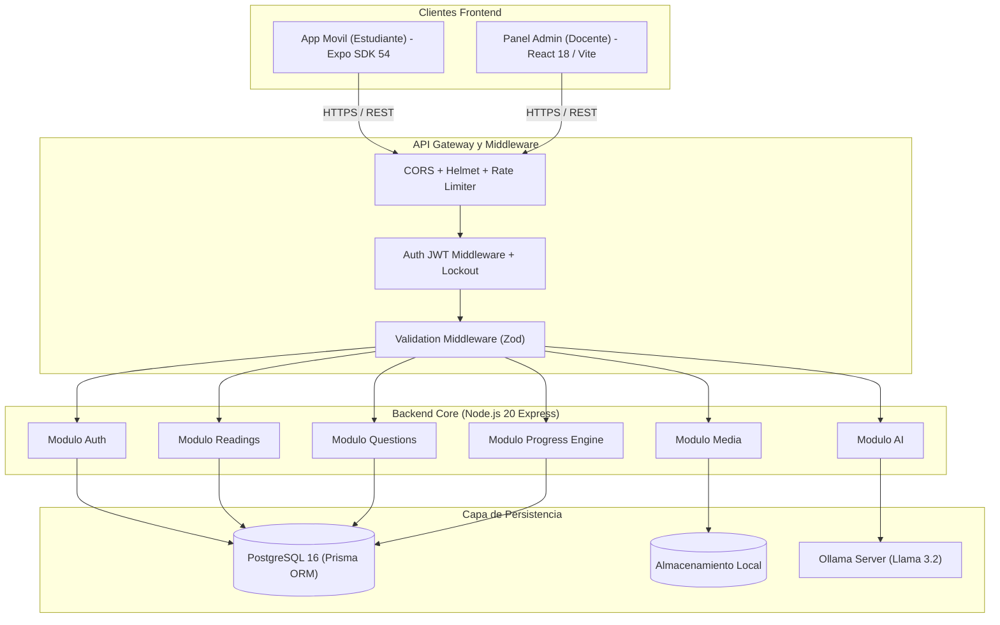

<div align="center">

# 📚 LectoApp
### Plataforma Educativa Gamificada de Comprensión Lectora

[](https://github.com)
[-brightgreen?style=for-the-badge)](https://github.com)
[](https://www.typescriptlang.org/)
[](https://nodejs.org/)
[](https://react.dev/)
[](https://expo.dev/)
[](https://www.postgresql.org/)
[](https://www.w3.org/WAI/standards-guidelines/wcag/)

<p align="center">
  <b>Un ecosistema integral de software diseñado para transformar la comprensión lectora en estudiantes a través de una progresión pedagógica multinivel, gamificación en tiempo real, generación editorial asistida por IA local y autonomía administrativa total.</b>
</p>

[Arquitectura](#-arquitectura-del-sistema) •
[Módulos del Monorepo](#-estructura-del-ecosistema) •
[Modelo Pedagógico](#-modelo-pedagógico-y-gamificación) •
[Seguridad y Calidad](#-seguridad-resiliencia-y-qa) •
[Guía de Inicio](#-guía-de-instalación-y-desarrollo) •
[Portfolio](#-landing-del-portfolio)

---

</div>

## 🌟 Visión del Producto

En Guatemala y América Latina, más del 60% de los estudiantes de nivel primario y secundario leen de manera mecánica sin comprender a profundidad los textos ni desarrollar pensamiento crítico. **LectoApp** fue concebido y desarrollado para resolver esta problemática de raíz:

1. **Autonomía Editorial Total:** Permite al equipo docente y administrativo crear, auditar, generar con IA y publicar lecturas y cuestionarios sin depender de desarrolladores ni terceros.
2. **Progresión Pedagógica Estructurada:** Mide y entrena las tres dimensiones fundamentales de la lectura: *Literal*, *Inferencial* y *Crítica*.
3. **Enganche Gamificado:** Retención mediante rachas diarias (*streaks*), acumulación de puntos, rangos de maestría y retroalimentación inmediata.
4. **Accesibilidad e Inclusión:** Diseñado para ejecutarse fluidamente en dispositivos Android de gama media/baja con compatibilidad estricta **WCAG 2.2 AA**.

---

## 🏛 Arquitectura del Sistema

LectoApp está diseñado bajo los principios de **Clean Architecture**, separación estricta de responsabilidades y bajo acoplamiento. Todos los clientes interactúan de forma aislada a través de una API REST protegida y tipada contractualmente.



### Decisiones Arquitectónicas Clave (ADRs)

* **ADR-001 (Monorepo Cohesivo):** Gestión centralizada de contratos (`contracts/api.contract.json` y `contracts/design-tokens.json`), facilitando la sincronización de tipos entre backend, panel web y móvil.
* **ADR-002 (Clean Architecture en Backend):** Flujo unidireccional estricto:
  `Request` → `Route` → `Auth/RateLimit` → `Zod Validator` → `Controller` → `Service` → `Prisma` → `Response`
  Los controladores solo orquestan HTTP; la lógica pura reside en los servicios.
* **ADR-004 (IA Local Human-in-the-Loop):** Generación de preguntas asistida por IA local con Ollama (`Llama 3.2`). Todo contenido generado nace en estado `DRAFT` y requiere aprobación humana explícita antes de alcanzar el umbral de publicación (≥ 5 preguntas aprobadas).
* **ADR-007 (StorageProvider Desacoplado):** `MediaService` escribe contra una interfaz `StorageProvider`. La implementación actual (`LocalDiskStorageProvider`) maneja firmas binarias reales (*magic bytes*) y generación de UUIDs; la migración a Google Cloud Storage o S3 se realiza sin tocar una sola línea del controlador o servicio.

---

## 📦 Estructura del Ecosistema

```text
MoodleClone/
├── backend/                # API REST Node.js 20 + Express + Prisma + PostgreSQL
│   ├── src/
│   │   ├── config/         # Logger Winston/Morgan, base de datos y validación de envs (Zod)
│   │   ├── middleware/     # Auth JWT, RBAC, validación, rate limiters, upload
│   │   ├── modules/        # Auth, Readings, Questions, Users, Progress, Media, Stats, AI
│   │   └── shared/         # Errores de dominio, StorageProvider, sanitización HTML
│   └── tests/              # 233 tests (unitarios, integración, mutación y contrato)
│
├── admin/                  # Panel de Administración SPA (React 18 + Vite)
│   ├── src/
│   │   ├── components/     # UI Kit accesible, diálogos Radix, formularios, gráficas
│   │   ├── hooks/          # TanStack Query hooks para consumo optimista
│   │   ├── pages/          # Dashboard, Lecturas, Editor de Preguntas, Preview, Login
│   │   ├── stores/         # Estado de sesión con Zustand
│   │   └── styles/         # Design Tokens centralizados en CSS Modules
│   └── tests/              # 172 tests (Vitest + Testing Library + axe-core a11y)
│
├── mobile/                 # App Móvil Estudiantil (React Native Expo SDK 54)
│   ├── src/
│   │   ├── api/            # Cliente HTTP con timeout, reintentos y refresh de sesión
│   │   ├── components/     # Tarjetas accesibles, badges, modales de felicitación
│   │   ├── context/        # AuthContext persistido con expo-secure-store
│   │   ├── navigation/     # Stack + Bottom Tabs con Deep Linking
│   │   ├── screens/        # Login, Registro, Mapa de Lectura, Lector, Quiz, Perfil
│   │   └── theme/          # Paleta WCAG 2.2 AA validada por contraste
│   └── src/**/__tests__/   # 59 tests de componentes, navegación y contratos
│
├── contracts/              # Single Source of Truth para contratos de API y Tokens
├── portfolio/              # Landing page interactiva de presentación para portafolio
├── docker-compose.yml      # Orquestación de servicios (API, Admin, Postgres, Ollama)
└── TASKS.md                # Bitácora detallada de sprints y estado del proyecto
```

---

## 🧠 Modelo Pedagógico y Gamificación

LectoApp implementa una taxonomía de comprensión lectora respaldada por pedagogía moderna:

| Nivel de Comprensión | Propósito Pedagógico | Tipo de Reto | Color Distintivo |
| :--- | :--- | :--- | :---: |
| **Literal** | Identificar información explícita, personajes, lugares y cronología directa en el texto. | Opción múltiple / Verdadero o Falso directo | 🔵 Azul Índigo |
| **Inferencial** | Deducir causas, intenciones, significados por contexto y conclusiones implícitas. | Selección de hipótesis / Deducción | 🟣 Púrpura |
| **Crítico** | Evaluar la postura del autor, juzgar argumentos y formar opiniones fundamentadas. | Juicio valorativo / Análisis de premisas | 🟢 Esmeralda |

### Motor de Gamificación y Progresión
* **Regla de Aprobación:** Calificación **≥ 70%** en el cuestionario para marcar la lectura como completada.
* **Escalafón de Maestría:** `Principiante` → `Intermedio` → `Avanzado` → `Experto` → `Supremo`.
* **Racha de Lectura (*Streaks*):** Días consecutivos completando al menos un reto de lectura, reconciliado con la zona horaria del servidor.
* **Puntos de Experiencia:** Otorgados dinámicamente según la complejidad del texto y el porcentaje de aciertos.

---

## 🔒 Seguridad, Resiliencia y QA

El sistema fue sometido a una auditoría estricta de seguridad y calidad técnica bajo estándares **OWASP** y **WCAG**:

### Medidas de Seguridad Implementadas
* **Autenticación Robusta:** JWT dual (`accessToken` de 15 min + `refreshToken` de 7 días con rotación automática y detección de robo de familia).
* **Defensa contra Fuerza Bruta:** Bloqueo automático de cuenta por 15 minutos tras 5 intentos fallidos (`lockedUntil`), mitigado contra ataques de enumeración.
* **Rate Limiting Diferenciado:** Limitadores independientes para endpoints de alta demanda (`/auth/login`, `/auth/register`, `/media/upload`, `/ai`).
* **Subida Segura de Archivos:** Validación por firma binaria real (*magic bytes*), nombres sanitizados con UUIDv4 y escritura con bandera `wx` contra sobreescrituras.
* **Almacén Seguro Móvil:** Persistencia de credenciales con `expo-secure-store` sobre Android Keystore / iOS Keychain.

### Calidad y Cobertura de Pruebas

```
==================================================================================
 MÓDULO        TEST SUITES    TESTS PASANDO    TIPO DE PRUEBAS
==================================================================================
 Backend       20 suites      233 / 233        Unitarios, Integración, Zod, Mutación
 Admin Panel   33 suites      172 / 172        Vitest, Testing Library, axe-core a11y
 App Móvil      8 suites       59 / 59         RNTL, Componentes, Flujos, Contrato
----------------------------------------------------------------------------------
 TOTAL         61 suites      464 / 464        🏆 100% Passing (Cero fallos)
==================================================================================
```

---

## 🚀 Guía de Instalación y Desarrollo

### Prerrequisitos
* **Node.js:** v20.x o v22.x LTS
* **Gestor de paquetes:** `pnpm` (v9+)
* **Docker y Docker Compose:** Para PostgreSQL y servicios de soporte

### 1. Clonar el repositorio y configurar variables de entorno
```bash
git clone https://github.com/TU_USUARIO/lectoapp.git
cd lectoapp

# Copiar plantillas de entorno
cp .env.example .env
cp backend/.env.example backend/.env
cp admin/.env.example admin/.env
cp mobile/.env.example mobile/.env
```

### 2. Levantar la base de datos (Docker)
```bash
docker compose up -d lectoapp-postgres
```

### 3. Backend (API REST)
```bash
cd backend
pnpm install
pnpm exec prisma migrate dev    # Ejecutar migraciones en Postgres
pnpm exec prisma db seed        # Sembrar datos iniciales (admin y lecturas)
pnpm dev                        # Iniciar servidor en http://localhost:3000
pnpm test                       # Ejecutar suite de 233 pruebas
```

### 4. Panel de Administración (Web)
```bash
cd ../admin
pnpm install
pnpm dev                        # Iniciar panel en http://localhost:5173
pnpm test                       # Ejecutar suite de 172 pruebas
```

### 5. App Móvil (Expo)
```bash
cd ../mobile
pnpm install
pnpm start                      # Iniciar Metro Bundler (Escanear con Expo Go)
pnpm web                        # Previsualizar en navegador web
pnpm test                       # Ejecutar suite de 59 pruebas
```

---

## 🎨 Landing del Portfolio

El proyecto incluye en `/portfolio` una landing page interactiva desarrollada en Vanilla HTML5, CSS moderno y JavaScript modular, diseñada específicamente para exponer la arquitectura, capturas reales de pantalla y métricas técnicas del sistema ante reclutadores y clientes.

Para visualizarla, abre directamente `portfolio/index.html` en tu navegador o sírvela con cualquier servidor web estático.

---

## 📄 Licencia

Este proyecto fue desarrollado bajo arquitectura profesional para fines educativos y de portafolio técnico de alto nivel.
