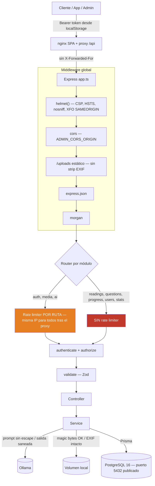
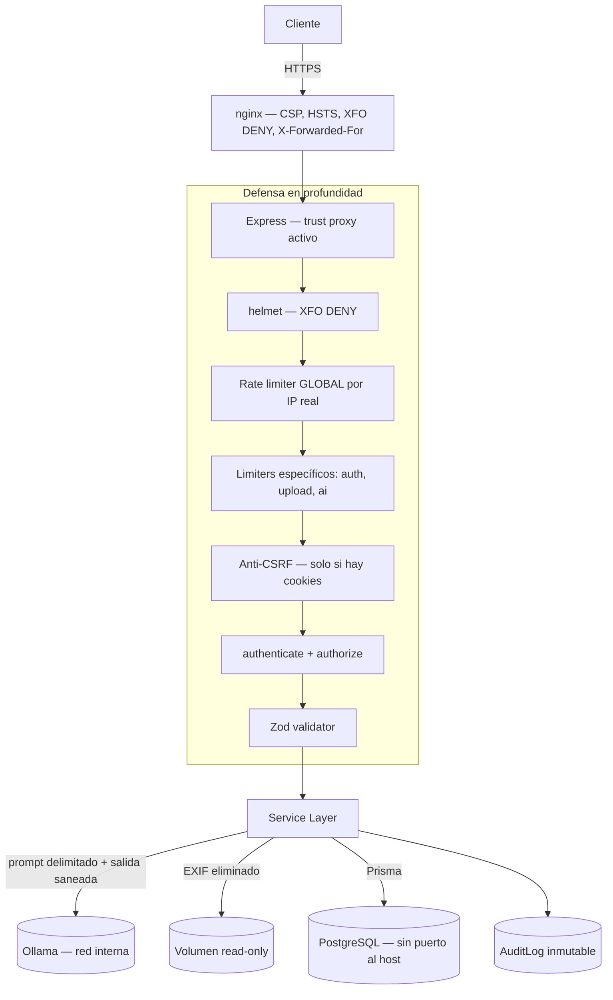

# SEC_IMPLEMENTATION.md — Plan Completo de Implementación de Seguridad (CISO Security Roadmap)

> **Documento:** Plan de Implementación de Seguridad & Hardening Enterprise
> **Versión:** 3.0 — *auditada contra el código real, ver §8*
> **Autor:** Chief Information Security Officer (CISO) & Security Solutions Architect
> **Ámbito:** Repositorio Completo (`/backend`, `/admin`, Infraestructura Docker, scripts auxiliares)
> **Fecha:** Agosto 2026

---

## 1. Visión General y Postura de Seguridad

LectoApp es una plataforma educativa gamificada orientada a estudiantes en Guatemala. Trata **datos de menores de edad**, integra un **servicio de IA generativa (Ollama LLM local)** y expone un **panel de administración con privilegios elevados**. La arquitectura se rige por OWASP API Security Top 10 (2023), OWASP Top 10 para LLM (2025) y CIS Docker Benchmark.

### 1.1 Marco normativo aplicable

Un despliegue en Guatemala **no** cae bajo COPPA ni FERPA — son normas estadounidenses (FERPA aplica a instituciones de EE.UU. con fondos federales; COPPA a servicios dirigidos a menores de 13 años en EE.UU.). El marco real es:

| Marco | Aplicabilidad | Implicación práctica |
|---|---|---|
| Constitución de Guatemala, art. 31 (habeas data) | **Directa** | Derecho de acceso y rectificación sobre datos personales del estudiante |
| Ley de Acceso a la Información Pública (Decreto 57-2008) | **Directa** si el cliente es o contrata con una entidad pública | Deber de custodia de datos sensibles de menores |
| ISO 27001 / CIS Benchmarks | Voluntaria | Referencia de controles técnicos adoptada en este documento |
| GDPR | Solo si en algún momento se procesan datos de residentes UE | Fuera de alcance hoy; reevaluar antes de cualquier expansión |

> Se citan COPPA/FERPA únicamente como *referencia de buenas prácticas de diseño para menores*, no como obligación de cumplimiento.

---

## 2. Metodología de Verificación

Toda fila marcada ✅ en §3 fue verificada **leyendo el código**, no por declaración. Cada afirmación lleva su referencia `archivo:línea`. Las filas 🔲 se verificaron por ausencia comprobada del control.

Comando de verificación de la afirmación más frágil de la v2.0 (IPs hardcodeadas), que debe correrse sobre **todo** el repo, no solo `/backend`:

```bash
# Correcto: cubre raíz, YAML, dotfiles y scripts auxiliares
git grep -n --untracked "192\.168\." -- . ':!*node_modules*'
```

> ⚠️ La v2.0 de este documento validó esa fila con un `grep --include=*.ts` limitado a `backend/` y `admin/`, lo que produjo un falso ✅. Ver §8.

---

## 3. Diagnóstico de Riesgos Verificado (v3.0)

### 3.1 Controles confirmados como implementados

| Control | Evidencia en código | Nota |
|---|---|---|
| **Sanitización de salida del LLM** | `ai.service.ts:155-170` | Cobertura completa: `statement`, `explanation`, `correctAnswer`, `options[].id`, `options[].text` |
| **Rate limiter específico de IA** | `rate-limiter.middleware.ts:26`, `ai.routes.ts:14` | 3 req/min. Correctamente colocado **antes** de `authenticate` |
| **Preguntas de IA nacen en `DRAFT`** | `ai.service.ts:172` | Control compensatorio clave: exige aprobación humana antes de publicar |
| **Sin stack trace en respuestas 500** | `error.middleware.ts:41-49` | El stack va solo a Winston |
| **Redacción de secretos en telemetría cliente** | `error-reporter.ts:33-52` | Recursivo; cubre `password`, `token`, `authorization`, `accesstoken`, `refreshtoken`, `secret` |
| **Verificación de tipo real de imagen (magic bytes)** | `media.service.ts:34-37` vía `shared/utils/image-signature` | No confía en `Content-Type` del cliente |
| **Sanitización de texto de usuario** | `shared/utils/sanitize-html.ts` | Política de texto plano (strip total), documentada y consciente |

### 3.2 Riesgos abiertos, por severidad real

| # | Vector de Ataque / Riesgo | Severidad | Estado | Fase |
|---|---|---|---|---|
| R-01 | **Secretos JWT y de BD por defecto, versionados en el repo** | 🔴 **Crítica** | 🔲 Abierto | **0.1** |
| R-02 | **IP interna `192.168.196.42` persistente en config e infra** | 🟠 Alta | 🔲 Abierto *(la v2.0 lo declaró cerrado por error)* | **0.2** |
| R-03 | **Postgres (5432) y Ollama (11434) publicados al host** | 🟠 Alta | 🔲 Abierto | **0.3** |
| R-04 | **Rate limiting inoperante detrás del proxy nginx** | 🟠 Alta | 🔲 Abierto | **1.1** |
| R-05 | **No existe rate limiter global** — 5 de 8 módulos sin throttling | 🟠 Alta | 🔲 Abierto | **1.2** |
| R-06 | **Refresh token en `localStorage`** (legible por XSS) | 🟠 Alta | 🔲 Abierto | **2.1** |
| R-07 | **`nginx.conf` sin ninguna cabecera de seguridad** | 🟡 Media-Alta | 🔲 Abierto | **3.1** |
| R-08 | **Inyección indirecta de prompts** (distinta del XSS, ya mitigado) | 🟡 Media | 🔲 Abierto *(mitigado parcialmente por R-08c)* | **3.3** |
| R-09 | **Contenedores corren como `root`, sin límites de recursos** | 🟡 Media | 🔲 Abierto | **4.1** |
| R-10 | **Metadatos EXIF/GPS conservados en imágenes subidas** | 🟡 Media | 🔲 Abierto | **4.2** |
| R-11 | **Sin masking de PII en logs de servidor**; `console.error` evade Winston | 🟡 Media | 🔲 Abierto | **5.1** |
| R-12 | **Sin audit trail de acciones administrativas** | 🟡 Media | 🔲 Abierto | **5.2** |
| R-13 | **CI sin escaneo de dependencias ni SAST** | 🟢 Baja | 🔲 Abierto | **6.1** |
| R-14 | **`X-Frame-Options: SAMEORIGIN`** en API (helmet default), no `DENY` | 🟢 Baja | 🔲 Abierto | **3.2** |

### 3.3 Detalle de los riesgos críticos y altos

**R-01 — Secretos por defecto versionados.**
`compose.yml` fija `NODE_ENV: production` y a la vez provee defaults de firma:
```yaml
JWT_ACCESS_SECRET: ${JWT_ACCESS_SECRET:-change_this_access_secret_in_prod_2026}
JWT_REFRESH_SECRET: ${JWT_REFRESH_SECRET:-change_this_refresh_secret_in_prod_2026}
POSTGRES_PASSWORD: ${POSTGRES_PASSWORD:-lectoapp_secret_2026}
```
`.env.example:15-16` repite el patrón, y `.env.example:6` fija `NODE_ENV=production`. Un `docker compose up` sin `.env` levanta un stack marcado como producción con **claves de firma públicas en el código fuente**: cualquiera que lea el repositorio puede forjar un JWT de ADMIN válido y acceder a la totalidad de los datos de menores. `config/env.ts:11-12` solo exige `.min(1)`, así que la validación de entorno lo aprueba sin objeción. Viola directamente la Regla #2 de §6.

**R-02 — IP interna persistente.**
La remediación de la v2.0 alcanzó solo el TypeScript. La IP sigue activa en:
`docker-compose.override.yml:28` (**este archivo lo carga `docker compose up` automáticamente**, por lo que es el default efectivo en runtime), `compose.override.external-ollama.yml:28`, `.env.example:28` (sin comentar), `scratch/benchmark_models.js:41`, `scratch/test_ai_endpoint.js:38`, `scratch/test_ollama.js:10,14` y `ARCHITECTURE.md:618-621`.

**R-04 — Rate limiting inoperante tras el proxy.**
`admin/Dockerfile` sirve la SPA con nginx, que proxea `/api/` a `backend:3000`. `admin/nginx.conf:14-21` **no** envía `X-Forwarded-For`, y `app.ts` **no** declara `app.set('trust proxy')`. En el despliegue Docker todas las peticiones llegan con la IP del contenedor nginx: los 3 req/min de IA y los 10 login/min se convierten en un **cubo único compartido por todos los usuarios**. Esto degrada el ✅ que la v2.0 otorgó a la protección DoS de IA y anula la defensa contra fuerza bruta en login.

**R-05 — No existe rate limiter global.**
`config/env.ts:19-20` declara `RATE_LIMIT_WINDOW_MS` y `RATE_LIMIT_MAX_REQUESTS`; **ninguna de las dos se usa en el código**. Los limitadores existentes son solo por ruta (register, login, upload, ai). Quedan sin throttling: `/api/readings`, `/api/questions`, `/api/progress`, `/api/users`, `/api/stats`.

**R-07 — Cabeceras: el gap está en nginx, no en Express.**
`app.ts:39` ya aplica `helmet()` v8.3.0, que **por defecto** entrega `Content-Security-Policy: default-src 'self'`, `Strict-Transport-Security`, `X-Content-Type-Options: nosniff` y `X-Frame-Options: SAMEORIGIN`. El plan v2.0 marcaba toda la fase como pendiente, desviando el esfuerzo al componente equivocado: **quien sirve HTML es nginx**, y `admin/nginx.conf` no emite ni una sola cabecera de seguridad. Ahí es donde el CSP tiene efecto real.

**R-08 — Inyección de prompts ≠ XSS vía IA.**
La v2.0 fusionó ambos en una fila y la marcó ✅. Son problemas distintos:
- *XSS almacenado vía IA* — **sí está remediado** (`ai.service.ts:155-170`).
- *Inyección indirecta de prompts* — **no**. `ai.service.ts:64` interpola `reading.content` crudo en el prompt, sin delimitadores ni escape. Un texto con instrucciones embebidas sigue pudiendo dirigir al modelo.
- *(R-08c) Control compensatorio* — el endpoint es admin-only (`ai.routes.ts:15-16`) y las preguntas generadas nacen en `status: 'DRAFT'` (`ai.service.ts:172`), exigiendo aprobación humana. Esto reduce la severidad real a Media y es la razón por la que R-08 no bloquea el release.

---

## 4. Arquitectura de Seguridad

### 4.1 Estado real hoy

> Este diagrama refleja lo que el código hace, no lo que se desea. La v2.0 dibujaba una cadena global de middlewares que no existe.



### 4.2 Arquitectura objetivo (al cierre de Fase 6)



---

## 5. Plan de Implementación Re-priorizado

> El orden de la v2.0 seguía categorías OWASP. Este sigue **explotabilidad real**: primero lo que hoy permite comprometer el sistema por completo.

### Fase 0 — Contención inmediata (bloquea cualquier despliegue)

- **0.1 Erradicar secretos por defecto** *(R-01)*
  - **Archivos:** `compose.yml`, `.env.example`, `backend/src/config/env.ts`
  - **Detalle:** Eliminar todos los `:-valor_por_defecto` de `JWT_ACCESS_SECRET`, `JWT_REFRESH_SECRET` y `POSTGRES_PASSWORD` — el arranque debe **fallar** si no están definidos. En `env.ts`, endurecer a `.min(32)` y rechazar explícitamente valores conocidos (`change_this_*`, `cambiar_este_*`) cuando `NODE_ENV === 'production'`. En `.env.example`, cambiar `NODE_ENV=production` → `development` y dejar los secretos vacíos con instrucción de generarlos (`openssl rand -base64 48`).
  - **Criterio de aceptación:** `docker compose up` sin `.env` falla con un error claro, no arranca con claves conocidas.

- **0.2 Erradicar la IP interna de toda la superficie** *(R-02)*
  - **Archivos:** `docker-compose.override.yml`, `compose.override.external-ollama.yml`, `.env.example`, `scratch/*.js`, `ARCHITECTURE.md`
  - **Detalle:** Sustituir el default `${OLLAMA_HOST:-http://192.168.196.42:11434}` por `${OLLAMA_HOST:?OLLAMA_HOST es requerido}`. En `.env.example`, comentar la opción de IP remota y dejar activa la opción Docker (`http://ollama:11434`). Sustituir la IP por un placeholder (`http://TU_SERVIDOR_OLLAMA:11434`) en docs y scripts. Evaluar añadir `scratch/` a `.gitignore`.
  - **Criterio de aceptación:** el comando de §2 no devuelve coincidencias.

- **0.3 Cerrar puertos de infraestructura** *(R-03)*
  - **Archivos:** `compose.yml`
  - **Detalle:** Eliminar el mapeo `ports:` de `postgres` (5432) y `ollama` (11434). Ambos son alcanzables por nombre de servicio dentro de la red Docker; no necesitan exponerse al host. Si se requiere acceso puntual de depuración, hacerlo con un override de desarrollo, nunca en `compose.yml`.

### Fase 1 — Restaurar la eficacia del rate limiting

- **1.1 Confianza en el proxy** *(R-04)*
  - **Archivos:** `backend/src/app.ts`, `admin/nginx.conf`
  - **Detalle:** Añadir `proxy_set_header X-Forwarded-For $proxy_add_x_forwarded_for;` y `proxy_set_header X-Real-IP $remote_addr;` en nginx. En Express, `app.set('trust proxy', 1)` — valor numérico exacto, nunca `true`, que permitiría falsificar la IP vía cabecera.
  - **Nota:** esta corrección es la que hace realmente efectivo el `aiRateLimiter` ya implementado.

- **1.2 Rate limiter global** *(R-05)*
  - **Archivos:** `backend/src/app.ts`, `backend/src/middleware/rate-limiter.middleware.ts`
  - **Detalle:** Instanciar un limitador global con las variables ya declaradas y hoy muertas `RATE_LIMIT_WINDOW_MS` / `RATE_LIMIT_MAX_REQUESTS`, y aplicarlo con `app.use()` antes del router. Los limitadores específicos se mantienen y actúan como refuerzo.

### Fase 2 — Sesiones

- **2.1 + 2.2 Cookies `httpOnly` y anti-CSRF — entregable ÚNICO y atómico** *(R-06)*
  - **Archivos:** `backend/src/modules/auth/auth.controller.ts`, `auth.service.ts`, `backend/src/app.ts`, `admin/src/services/api-client.ts`, `admin/src/stores/authStore.ts`
  - **Detalle:** Migrar `refreshToken` a `Set-Cookie: refreshToken=...; HttpOnly; Secure; SameSite=Strict; Path=/api/auth`. Retirarlo del store persistido de Zustand (hoy en `localStorage`). Añadir `cookie-parser` y validación anti-CSRF (`SameSite=Strict` + verificación de `Origin`) sobre las rutas mutables.
  - **⚠️ No separar en dos fases.** Hoy **no existe riesgo CSRF**: el token viaja como `Bearer` (`api-client.ts:43`), sin credenciales ambientales. El CSRF nace en el momento en que se adoptan cookies. Implementar 2.1 sin 2.2 **introduciría** una vulnerabilidad que hoy no existe. Deben entrar en el mismo PR.

### Fase 3 — Cabeceras HTTP y superficie del LLM

- **3.1 Cabeceras de seguridad en nginx** *(R-07)* — **aquí está el gap real**
  - **Archivos:** `admin/nginx.conf`
  - **Detalle:** Añadir `Content-Security-Policy` (`default-src 'self'; img-src 'self' data: <origen-API>; object-src 'none'; frame-ancestors 'none'; base-uri 'self'`), `Strict-Transport-Security`, `X-Content-Type-Options: nosniff`, `X-Frame-Options: DENY` y `Referrer-Policy: strict-origin-when-cross-origin`.
- **3.2 `X-Frame-Options: DENY` en la API** *(R-14)*
  - **Archivos:** `backend/src/app.ts` — `helmet({ frameguard: { action: 'deny' } })`. El resto de defaults de helmet ya son correctos y **no deben tocarse**.
- **3.3 Endurecer el prompt contra inyección indirecta** *(R-08)*
  - **Archivos:** `backend/src/modules/ai/ai.service.ts`
  - **Detalle:** Envolver `reading.content` en delimitadores explícitos, escapar la secuencia delimitadora dentro del contenido, e instruir al modelo a tratar ese bloque como datos y nunca como instrucciones. Mantener `status: 'DRAFT'` como control compensatorio — es la defensa más sólida y no debe eliminarse.

### Fase 4 — Contenedores y archivos

- **4.1 Hardening de contenedores** *(R-09)*
  - **Archivos:** `backend/Dockerfile`, `admin/Dockerfile`, `compose.yml`
  - **Detalle:** `USER node` en el stage `runner` del backend (verificando permisos de escritura sobre `/app/uploads`); usuario no-root en la imagen de nginx. En `compose.yml`: `read_only: true` donde sea viable, `cap_drop: [ALL]`, `security_opt: [no-new-privileges:true]` y `deploy.resources.limits.memory` por servicio.
- **4.2 Limpieza de EXIF** *(R-10)*
  - **Archivos:** `backend/src/modules/media/media.service.ts`, `backend/package.json`
  - **Detalle:** Requiere añadir `sharp` (hoy no es dependencia). Reprocesar el buffer en memoria descartando metadatos antes de `storage.save()` (`media.service.ts:46`). Crítico porque las fotos de perfil de menores pueden llevar GPS.

### Fase 5 — Observabilidad y trazabilidad

- **5.1 Masking de PII en logs + eliminar `console.error`** *(R-11)*
  - **Archivos:** `backend/src/config/logger.ts`, `backend/src/modules/ai/ai.service.ts`
  - **Detalle:** Formateador Winston que enmascare correos y credenciales en producción. **Sustituir el `console.error` de `ai.service.ts:136` por `logger.error`** — hoy evade Winston por completo, por lo que el masking planificado no lo cubriría. Revisar además que el mensaje de error de Ollama propagado al cliente (`ai.service.ts:137-139`) no filtre la URL interna del servidor.
- **5.2 Audit trail inmutable** *(R-12)*
  - **Archivos:** `backend/prisma/schema.prisma`, nuevo módulo `backend/src/modules/audit/`
  - **Detalle:** No existe modelo `AuditLog`. Crear tabla append-only (`id`, `actorId`, `action`, `entityType`, `entityId`, `metadata`, `createdAt`; **sin** `updatedAt` ni `deletedAt`, coherente con la convención de hechos inmutables de `CLAUDE.md`). Registrar creación/edición/aprobación de lecturas y preguntas.

### Fase 6 — DevSecOps y pruebas ofensivas

- **6.1 CI de seguridad** *(R-13)*
  - **Archivos:** `.github/workflows/security.yml` (nuevo — hoy solo existe `ci.yml`, sin ningún paso de seguridad)
  - **Detalle:** `pnpm audit --prod` en ambos paquetes, `trivy fs .`, y escaneo de secretos (`gitleaks`) — este último habría detectado R-01 y R-02 automáticamente.
- **6.2 Suite de pruebas de seguridad**
  - **Archivos:** `backend/tests/security/` (no existe)
  - **Detalle:** Payloads XSS/SQLi contra los endpoints de escritura; JSON malformado en la respuesta simulada de Ollama; verificación de que un error 500 nunca expone stack trace; verificación de que las rutas admin rechazan tokens de rol `STUDENT`.

---

## 6. Reglas de Código Seguro

1. **Entradas y salidas de texto.** Todo texto proveniente de usuarios **o de modelos de IA** debe pasar por `sanitizePlainText()` antes de persistirse. La política vigente es strip total de etiquetas; si se introduce un editor rich-text, migrar a allowlist explícito (`ARCHITECTURE.md` → R-04).
2. **Sin credenciales, secretos ni IPs en el repositorio.** Aplica a `.ts`, **y también a `.yml`, `.env.example`, `Dockerfile`, documentación y scripts de `scratch/`**. Verificar con el comando de §2 antes de cada PR.
3. **Manejo de errores.** Usar las clases de `shared/errors/`. Responder siempre `{ success: false, data: null, error: string }`. Nunca `console.*` en `backend/src/` — siempre `logger`.
4. **Mínimo privilegio.** Rutas administrativas: `authenticate` + `authorize(UserRole.ADMIN)`. Contenedores: usuario no-root, capacidades mínimas.
5. **Los rate limiters van antes de `authenticate`.** Un atacante no autenticado debe agotar la cuota antes de tocar la lógica de verificación de tokens.
6. **Contenido no confiable dentro de prompts.** Todo texto que llegue al LLM va delimitado y marcado explícitamente como datos, nunca concatenado como instrucción.

---

## 7. Matriz de Verificación

```bash
# Secretos e IPs — debe devolver CERO coincidencias
git grep -n --untracked -E "192\.168\.|change_this_|cambiar_este_" -- . ':!*node_modules*' ':!SEC_IMPLEMENTATION.md'

# El arranque debe FALLAR sin secretos definidos
docker compose --env-file /dev/null config >/dev/null && echo "FALLO: arrancó sin secretos"

# Backend: lint + tests + build
#   Nota: `pnpm check` NO incluye `prisma generate`; en un clone limpio hay que
#   ejecutarlo antes o tsc/vitest no resuelven los tipos generados.
cd backend && pnpm exec prisma generate && pnpm check

# Admin: lint + tests + build + presupuesto de bundle
cd admin && pnpm check

# Auditoría de dependencias
cd backend && pnpm audit --prod
cd admin && pnpm audit --prod
```

### Criterios de cierre por fase

| Fase | Criterio objetivo de aceptación |
|---|---|
| 0 | `git grep` de §7 sin coincidencias; el stack no arranca sin secretos; `docker compose ps` no muestra 5432 ni 11434 publicados |
| 1 | Test de integración: 11 logins desde una IP → 429; desde dos IPs distintas vía `X-Forwarded-For` → ambas permitidas |
| 2 | `localStorage` no contiene `refreshToken`; petición mutable con `Origin` ajeno → 403 |
| 3 | `curl -I` contra nginx muestra CSP, HSTS, `X-Frame-Options: DENY` |
| 4 | `docker exec <c> whoami` ≠ `root`; imagen con GPS subida y releída sin metadatos |
| 5 | Log de producción con un login no contiene el correo en claro; `AuditLog` registra una aprobación |
| 6 | `security.yml` en verde; `backend/tests/security/` con la suite pasando |

---

## 8. Registro de Cambios v2.0 → v3.0

Auditoría del documento contra el código real. Correcciones aplicadas:

| # | Corrección |
|---|---|
| 1 | **Falso positivo revertido.** La fila "Exposición de IP Interna" estaba marcada ✅ Remediado. La IP solo se retiró del TypeScript; persiste en 3 archivos de configuración —incluido `docker-compose.override.yml`, de carga automática— y 3 scripts. Reabierta como **R-02**. |
| 2 | **Diagrama corregido.** El de la v2.0 mostraba una cadena global `Helmet → RateLimiter → Auth → Zod` que no existe: los limitadores son por ruta y no hay limitador global. Sustituido por un diagrama de estado real (§4.1) más uno de objetivo (§4.2). |
| 3 | **Fase CSP re-dirigida.** La v2.0 la marcaba pendiente en bloque; `helmet()` v8.3.0 ya entrega CSP, HSTS y `nosniff` en la API. El hueco real es `admin/nginx.conf`, sin ninguna cabecera. Separado en R-07 (nginx, prioritario) y R-14 (`frameguard: DENY`, menor). |
| 4 | **Cookies y CSRF fusionados.** Eran las fases 1.2 y 1.3 independientes. Hoy no hay riesgo CSRF (tokens `Bearer`); aparecería justo al migrar a cookies. Separarlas invitaba a introducir una vulnerabilidad inexistente. Ahora es el entregable atómico 2.1+2.2. |
| 5 | **Inyección de prompts desacoplada del XSS.** Estaban en una sola fila marcada ✅. El XSS sí está remediado; la inyección de prompts no (`ai.service.ts:64`). Reabierta como R-08, con el control compensatorio `DRAFT` documentado explícitamente. |
| 6 | **Riesgos nuevos añadidos:** R-01 (secretos versionados, crítico), R-03 (puertos expuestos), R-04 (rate limiting roto tras el proxy), R-05 (sin limitador global), R-11b (`console.error` evade Winston). Ninguno figuraba en la v2.0. |
| 7 | **Marco normativo corregido.** COPPA/FERPA no aplican a un despliegue en Guatemala; sustituidos por el marco nacional real (§1.1). |
| 8 | **Metodología de verificación añadida (§2)**, con el comando correcto y la nota sobre el `grep` defectuoso que causó el falso positivo de la v2.0. |
| 9 | **Matriz de verificación reparada.** Se documenta que `pnpm check` del backend requiere `prisma generate` previo en un clone limpio, y se añaden criterios objetivos de cierre por fase. |

---

> [!IMPORTANT]
> Este archivo es la especificación oficial de seguridad del proyecto. Toda fila marcada ✅ debe llevar su referencia `archivo:línea` verificable — **una remediación no se declara cerrada sin evidencia en código**. La v2.0 cerró un riesgo por inspección parcial; el §2 existe para que no vuelva a ocurrir.
