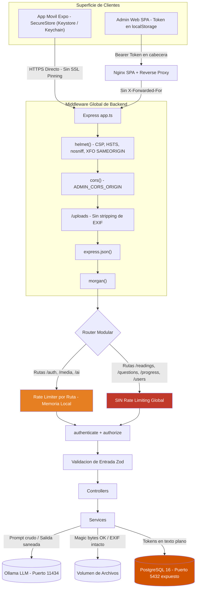
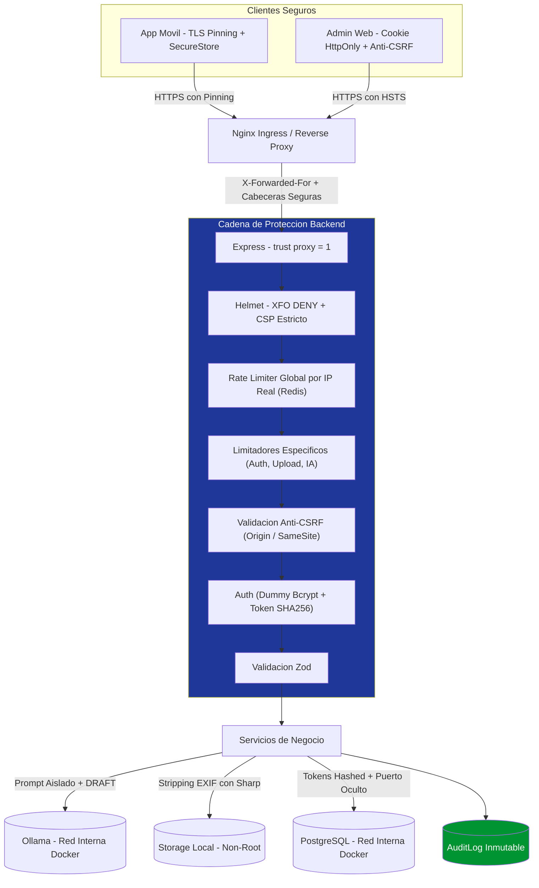

# SEC_IMPLEMENTATION.md — Plan Completo de Implementación de Seguridad (CISO Security Roadmap)

> **Documento:** Plan de Implementación de Seguridad, Análisis de Amenazas & Hardening Enterprise  
> **Versión:** 4.0 — *Auditada contra el código real, incorporando App Móvil React Native, Auditoría CISO y suite de 464 tests*  
> **Autor:** Chief Information Security Officer (CISO) & Security Solutions Architect  
> **Ámbito:** Repositorio Completo (`/backend`, `/admin`, `/mobile`, Infraestructura Docker, Scripts y CI/CD)  
> **Fecha:** Septiembre 2026  

---

## 1. Visión General y Postura de Seguridad

LectoApp es una plataforma educativa gamificada orientada a estudiantes de primaria y secundaria en Guatemala. El ecosistema procesa **datos de menores de edad**, integra un **servicio de IA generativa local (Ollama LLM)**, expone un **panel de administración web con privilegios elevados** y despliega una **aplicación móvil nativa (React Native Expo)** para estudiantes.

La arquitectura de seguridad se evalúa bajo:
- **OWASP Top 10** (2021/2025)
- **OWASP API Security Top 10** (2023)
- **OWASP Mobile Application Security Verification Standard (MASVS v2.0)**
- **OWASP Top 10 for Large Language Models** (2025)
- **CIS Docker Benchmark v1.6**

### 1.1 Marco normativo aplicable

Un despliegue en Guatemala **no** está sujeto por jurisdicción a COPPA ni FERPA (estatutos federales de EE.UU.). El marco legal y de cumplimiento vinculante es:

| Marco | Aplicabilidad | Implicación práctica |
|---|---|---|
| **Constitución Política de la República de Guatemala, art. 31** (Habeas Data) | **Directa** | Derecho irrestricto de acceso, actualización y rectificación sobre datos personales del estudiante y sus tutores |
| **Ley de Acceso a la Información Pública (Decreto 57-2008)** | **Directa** (si el cliente o implementador es entidad pública o contratista) | Deber de custodia reforzada y confidencialidad sobre datos sensibles de la niñez |
| **Ley de Protección Integral de la Niñez y Adolescencia (PINA)** | **Directa** | Protección de la identidad, imagen y dignidad de menores en entornos digitales |
| **ISO/IEC 27001 / CIS Benchmarks** | Voluntaria / Estándar técnico | Referencia de controles técnicos de hardening adoptada en este repositorio |
| **GDPR / COPPA / FERPA** | Referencial | Utilizados exclusivamente como estándares de diseño ético y seguridad por defecto para menores |

---

## 2. Metodología de Verificación y Rigor de Auditoría

Toda fila marcada ✅ en §3 fue verificada **leyendo el código fuente activo**, no por declaración de intenciones. Cada afirmación lleva su referencia inequívoca `archivo:línea`. Las filas 🔲 corresponden a riesgos abiertos por ausencia o deficiencia comprobada del control.

### Comandos de verificación continua:

```bash
# 1. Detección de secretos duros e IPs internas en TODO el repositorio
git grep -n --untracked -E "192\.168\.|change_this_|cambiar_este_" -- . ':!*node_modules*' ':!SEC_IMPLEMENTATION.md'

# 2. Verificación de exclusión estricta de archivos de entorno (.env)
git status --ignored | grep -E "\.env(\.|$)"

# 3. Comprobación del build y suite de pruebas integral (464 tests automatizados)
cd backend && pnpm exec prisma generate && pnpm test
cd ../admin && pnpm test
cd ../mobile && pnpm test
```

---

## 3. Diagnóstico de Riesgos Verificado (v4.0)

### 3.1 Controles confirmados como implementados

| Control | Evidencia en código | Eficacia / Nota |
|---|---|---|
| **Sanitización de salida del LLM** | `backend/src/modules/ai/ai.service.ts:155-170` | Cobertura integral: `statement`, `explanation`, `correctAnswer`, `options[].id`, `options[].text` mediante `sanitizePlainText()` |
| **Rate limiter específico para endpoints de IA** | `rate-limiter.middleware.ts:26`, `ai.routes.ts:14` | 3 req/min por IP. Correctamente ubicado **antes** de `authenticate` |
| **Preguntas de IA nacen en `DRAFT`** | `backend/src/modules/ai/ai.service.ts:172` | Control compensatorio de gobernanza: exige aprobación humana previa a publicación para alumnos |
| **Sin stack traces en respuestas HTTP 500** | `backend/src/middleware/error.middleware.ts:41-49` | El stack trace se confina exclusivamente a Winston; el cliente recibe un mensaje genérico |
| **Redacción de secretos en telemetría de cliente** | `admin/src/services/error-reporter.ts:33-52` | Redacción recursiva de `password`, `token`, `authorization`, `accesstoken`, `refreshtoken`, `secret` |
| **Verificación de tipo real de imagen (magic bytes)** | `media.service.ts:34-37` vía `shared/utils/image-signature` | Inspección de firmas binarias de buffer (`image/png`, `image/jpeg`, `image/webp`). No confía en el header `Content-Type` |
| **Sanitización estricta de texto de usuario** | `backend/src/shared/utils/sanitize-html.ts` | Política de texto plano (strip total de tags HTML/scripts) |
| **Almacenamiento seguro de tokens en Mobile** | `mobile/src/api/tokenStore.ts:29,36` | Uso de `expo-secure-store` en Android (Android Keystore / EncryptedSharedPreferences) e iOS (Keychain) |
| **Detección de reutilización de Refresh Token** | `backend/src/modules/auth/auth.service.ts:79-86` | Detección de token ya rotado: revoca de inmediato la familia completa de tokens (`family`) |
| **Validación de esquemas en frontera con Zod** | Todos los módulos en `backend/src/modules/*/*.schema.ts` | Tipado estricto en runtime para requests de auth, lectura, preguntas, avatares y progreso |
| **Higienización de repositorio y exclusión de .env** | `.gitignore` en raíz, `/backend`, `/admin` y `/mobile` | Repositorio limpio de `.env`, secretos de desarrollo y dumps locales |

---

### 3.2 Matriz de Riesgos Abiertos (Priorizada por Explotabilidad)

| # | Vector de Ataque / Vulnerabilidad | Severidad | Estado | Fase |
|---|---|---|---|---|
| **R-01** | **Secretos JWT y Postgres con valores por defecto en compose** | 🔴 **Crítica** | 🔲 Abierto | **0.1** |
| **R-02** | **IP interna `192.168.196.42` persistente en overrides/docs** | 🟠 Alta | 🔲 Abierto | **0.2** |
| **R-03** | **PostgreSQL (5432) y Ollama (11434) mapeados al host** | 🟠 Alta | 🔲 Abierto | **0.3** |
| **R-04** | **Rate limiting inoperante detrás de nginx (sin `trust proxy`)** | 🟠 Alta | 🔲 Abierto | **1.1** |
| **R-05** | **Ausencia de rate limiter global en la API** (5 módulos expuestos) | 🟠 Alta | 🔲 Abierto | **1.2** |
| **R-06** | **Refresh token en `localStorage` en Admin Web** | 🟠 Alta | 🔲 Abierto | **2.1** |
| **R-15** | **Refresh tokens en texto plano en la BD (`schema.prisma`)** | 🟠 **Alta** | 🔲 **Abierto (Nuevo)** | **2.3** |
| **R-07** | **`nginx.conf` de Admin sin cabeceras de seguridad HTTP** | 🟡 Media-Alta | 🔲 Abierto | **3.1** |
| **R-16** | **Mobile sin Certificate Pinning (Vulnerable a MitM en Wi-Fi)** | 🟡 **Media-Alta** | 🔲 **Abierto (Nuevo)** | **3.4** |
| **R-08** | **Inyección indirecta de prompts en generación de IA** | 🟡 Media | 🔲 Abierto *(Compensado por DRAFT)* | **3.3** |
| **R-09** | **Contenedores Docker corren como `root`, sin límites de recursos** | 🟡 Media | 🔲 Abierto | **4.1** |
| **R-10** | **Metadatos EXIF/GPS preservados en subida de avatares/imágenes** | 🟡 Media | 🔲 Abierto | **4.2** |
| **R-11** | **Sin masking de PII en logs; `console.error` evade Winston** | 🟡 Media | 🔲 Abierto | **5.1** |
| **R-12** | **Sin audit trail inmutable de acciones administrativas** | 🟡 Media | 🔲 Abierto | **5.2** |
| **R-17** | **Timing Attack en `login()` (Enumeración de correos por bcrypt)** | 🟡 **Media** | 🔲 **Abierto (Nuevo)** | **1.3** |
| **R-18** | **Rate limiting en memoria (Volátil en reinicios / DoS horizontal)** | 🟡 **Media** | 🔲 **Abierto (Nuevo)** | **1.4** |
| **R-13** | **CI sin escaneo de dependencias (SCA) ni SAST automatizado** | 🟢 Baja | 🔲 Abierto | **6.1** |
| **R-14** | **`X-Frame-Options: SAMEORIGIN`** en API (helmet default), no `DENY` | 🟢 Baja | 🔲 Abierto | **3.2** |

---

### 3.3 Análisis Técnico de Riesgos Críticos y Nuevos Hallazgos CISO

#### R-01 — Secretos por defecto en `compose.yml`
`compose.yml` define `NODE_ENV: production` junto a valores fallback públicos:
```yaml
JWT_ACCESS_SECRET: ${JWT_ACCESS_SECRET:-change_this_access_secret_in_prod_2026}
JWT_REFRESH_SECRET: ${JWT_REFRESH_SECRET:-change_this_refresh_secret_in_prod_2026}
POSTGRES_PASSWORD: ${POSTGRES_PASSWORD:-lectoapp_secret_2026}
```
Un despliegue descuidado que omita `.env` levantará un entorno productivo con claves de firma públicas. Cualquier atacante puede generar un token JWT con `role: "ADMIN"` y comprometer toda la base de datos de estudiantes.

#### R-15 — Refresh Tokens en texto plano en Base de Datos (Nuevo)
En `backend/src/modules/auth/auth.service.ts:71`:
```typescript
const storedToken = await this.prisma.refreshToken.findUnique({
  where: { token: refreshTokenValue },
});
```
El valor del token de refresco viaja y se almacena en texto plano en la tabla `RefreshToken`. Si la base de datos es expuesta mediante un backup no cifrado, una inyección indirecta o compromiso de credenciales Postgres, un atacante obtiene tokens válidos directamente utilizables para emitir nuevos `accessToken` sin requerir credenciales del usuario.
*Remediación:* Almacenar únicamente el resumen criptográfico `tokenHash = SHA256(refreshTokenValue)`.

#### R-16 — Superficie Móvil: Ausencia de TLS / Certificate Pinning (Nuevo)
En `mobile/src/api/http.ts`, la app móvil utiliza la función nativa `fetch` hacia el endpoint HTTPS configurado. En escenarios escolares o redes Wi-Fi públicas en Guatemala (cafés, escuelas, bibliotecas), un actor malicioso o un administrador de red con una Autoridad Certificadora (CA) privada instalada en el dispositivo puede interceptar y descifrar el tráfico completo mediante un ataque Man-in-the-Middle (MitM).  
*Remediación:* Implementar Certificate Pinning o Public Key Pinning en la capa de red nativa de React Native.

#### R-17 — Timing Attack en `AuthService.login` (Nuevo)
En `backend/src/modules/auth/auth.service.ts:38-53`:
```typescript
const user = await this.prisma.user.findUnique({ where: { email: input.email } });
if (!user) {
  throw new AuthenticationError('Credenciales inválidas'); // Responde en ~1-3ms
}
const isPasswordValid = await comparePassword(input.password, user.password); // Tarda ~80-120ms (bcrypt)
```
La diferencia en el tiempo de respuesta permite a un atacante automatizado medir la latencia y determinar fehacientemente si un correo electrónico está registrado en el sistema.
*Remediación:* Ejecutar una llamada ficticia `comparePassword(dummyHash, input.password)` cuando `!user` para igualar el perfil de latencia.

#### R-18 — Rate Limiter Volátil en Memoria Local (Nuevo)
`rate-limiter.middleware.ts` utiliza el almacén por defecto en memoria de `express-rate-limit`. Al escalar el backend a múltiples contenedores/instancias o tras un reinicio del proceso Node.js, las ventanas de conteo se reinician a cero, permitiendo sobrepasar las cuotas de fuerza bruta y saturación de IA.
*Remediación:* Integrar un store respaldado en Redis (`rate-limit-redis`) para deployments con múltiples réplicas.

---

## 4. Arquitectura de Seguridad

### 4.1 Diagrama de Flujo Actual (Superficie Real)



---

### 4.2 Arquitectura Objetivo (Hardening Enterprise)



---

## 5. Plan de Implementación Re-priorizado (Fases 0 a 6)

### Fase 0 — Contención Inmediata (Bloquea Despliegue en Producción)

- **0.1 Erradicar secretos por defecto** *(R-01)*
  - **Archivos:** `compose.yml`, `.env.example`, `backend/src/config/env.ts`
  - **Acción:** Eliminar valores por defecto con `:-` en `JWT_ACCESS_SECRET`, `JWT_REFRESH_SECRET` y `POSTGRES_PASSWORD`. Validar con Zod en `env.ts` longitud mínima de 32 caracteres y rechazo de patrones conocidos (`change_this*`).

- **0.2 Erradicar referencias a IPs internas** *(R-02)*
  - **Archivos:** `docker-compose.override.yml`, `compose.override.external-ollama.yml`, scripts en `scratch/`, documentación
  - **Acción:** Reemplazar `192.168.196.42` por variables de entorno obligatorias (`${OLLAMA_HOST:?OLLAMA_HOST requerido}`).

- **0.3 Cerrar puertos de infraestructura hacia el host** *(R-03)*
  - **Archivos:** `compose.yml`
  - **Acción:** Eliminar `ports: ["5432:5432"]` en `postgres` y `ports: ["11434:11434"]` en `ollama`. La comunicación debe ser exclusivamente intra-red Docker.

---

### Fase 1 — Hardening de Red y Autenticación

- **1.1 Configurar confianza de proxy inversa** *(R-04)*
  - **Archivos:** `backend/src/app.ts`, `admin/nginx.conf`
  - **Acción:** `app.set('trust proxy', 1)`. Inyectar `X-Forwarded-For` y `X-Real-IP` en la directiva de proxy de nginx.

- **1.2 Instanciar Rate Limiter Global** *(R-05)*
  - **Archivos:** `backend/src/app.ts`, `backend/src/middleware/rate-limiter.middleware.ts`
  - **Acción:** Conectar `RATE_LIMIT_WINDOW_MS` y `RATE_LIMIT_MAX_REQUESTS` (15 min / 100 req) como middleware global antes del enrutador modular.

- **1.3 Mitigación de Timing Attacks en Login** *(R-17)*
  - **Archivos:** `backend/src/modules/auth/auth.service.ts`
  - **Acción:** Implementar comparación de hash ficticio (`dummyCompare`) cuando el usuario no sea localizado en base de datos.

- **1.4 Persistencia Distribuida de Rate Limiting** *(R-18)*
  - **Archivos:** `backend/src/middleware/rate-limiter.middleware.ts`
  - **Acción:** Configurar almacén Redis para rate limiting cuando `REDIS_URL` esté provisto en el entorno.

---

### Fase 2 — Sesiones y Persistencia de Credenciales

- **2.1 + 2.2 Migración de Sesión Web a Cookies HttpOnly y Anti-CSRF** *(R-06)*
  - **Archivos:** `auth.controller.ts`, `auth.service.ts`, `admin/src/services/api-client.ts`, `admin/src/stores/authStore.ts`
  - **Acción:** Migrar `refreshToken` a cookie con banderas `HttpOnly; Secure; SameSite=Strict; Path=/api/auth`. Implementar verificación estricta de cabecera `Origin` / token anti-CSRF para rutas mutables.  
  *(Nota: en Mobile se mantiene `expo-secure-store`, no requiere cookies).*

- **2.3 Hashing Criptográfico de Refresh Tokens en Base de Datos** *(R-15)*
  - **Archivos:** `backend/prisma/schema.prisma`, `backend/src/modules/auth/auth.service.ts`
  - **Acción:** Modificar el campo `token` en la tabla `RefreshToken` a `tokenHash String @unique`. Computar `crypto.createHash('sha256').update(rawToken).digest('hex')` antes de almacenar y verificar.

---

### Fase 3 — Cabeceras, Móvil y Frontera de IA

- **3.1 Cabeceras de Seguridad en Nginx SPA** *(R-07)*
  - **Archivos:** `admin/nginx.conf`
  - **Acción:** Inyectar cabeceras: `Content-Security-Policy: default-src 'self' ...`, `Strict-Transport-Security: max-age=31536000; includeSubDomains`, `X-Content-Type-Options: nosniff`, `X-Frame-Options: DENY`.

- **3.2 `X-Frame-Options: DENY` en API Backend** *(R-14)*
  - **Archivos:** `backend/src/app.ts`
  - **Acción:** Ajustar `helmet({ frameguard: { action: 'deny' } })`.

- **3.3 Sanitización y Aislamiento de Prompts de IA** *(R-08)*
  - **Archivos:** `backend/src/modules/ai/ai.service.ts`
  - **Acción:** Delimitar el contenido de la lectura con etiquetas XML/markdown explícitas (`<context_data>...</context_data>`) e indicar al modelo ignorar instrucciones dentro del bloque de texto.

- **3.4 Certificate Pinning en Aplicación Móvil** *(R-16)*
  - **Archivos:** `mobile/src/api/http.ts`, `mobile/app.json`
  - **Acción:** Integrar validación de huella de clave pública (SPKI pinning) para el dominio productivo de la API.

---

### Fase 4 — Hardening de Contenedores y Gestión de Archivos

- **4.1 Usuarios No-Root y Recursos en Docker** *(R-09)*
  - **Archivos:** `backend/Dockerfile`, `admin/Dockerfile`, `compose.yml`
  - **Acción:** Declarar `USER node` en stage runner de Node.js. Restringir memoria y CPU (`deploy.resources.limits`) en `compose.yml`. Configurar `cap_drop: [ALL]`.

- **4.2 Stripping de Metadatos EXIF / GPS en Imágenes** *(R-10)*
  - **Archivos:** `backend/src/modules/media/media.service.ts`, `backend/package.json`
  - **Acción:** Procesar las imágenes de avatares con la librería `sharp` ejecutando `.rotate().toFormat('webp').toBuffer()` para descartar datos GPS/EXIF antes de guardarlas en disco.

---

### Fase 5 — Observabilidad, Masking y Auditoría

- **5.1 Masking de PII y Centralización de Logs** *(R-11)*
  - **Archivos:** `backend/src/config/logger.ts`, `backend/src/modules/ai/ai.service.ts`
  - **Acción:** Formateador Winston que enmascare emails (`u***@***.com`) y redacte contraseñas. Reemplazar `console.error` residuales por llamadas a `logger.error`.

- **5.2 Módulo de Registro de Auditoría Inmutable** *(R-12)*
  - **Archivos:** `backend/prisma/schema.prisma`, nuevo módulo `backend/src/modules/audit/`
  - **Acción:** Crear tabla append-only `AuditLog` (`id`, `actorId`, `action`, `entityType`, `entityId`, `metadata`, `createdAt`). Auditar creación, modificación y aprobación de lecturas y preguntas.

---

### Fase 6 — DevSecOps y Pruebas Automatizadas

- **6.1 Pipeline CI de Seguridad Automatizado** *(R-13)*
  - **Archivos:** `.github/workflows/security.yml`
  - **Acción:** Integrar escaneo de secretos con `gitleaks`, análisis de dependencias con `pnpm audit --prod` y escaneo SAST/vulnerabilidades con `trivy`.

- **6.2 Suite de Pruebas de Seguridad en Backend**
  - **Archivos:** `backend/tests/security/`
  - **Acción:** Tests automatizados contra payloads de inyección SQL, bypass de roles (`STUDENT` intentando acceder a rutas `/admin/*`), y validación de cabeceras de respuesta HTTP.

---

## 6. Reglas de Código Seguro para Desarrolladores

1. **Entradas y salidas de texto:** Todo texto generado por usuarios o devuelto por el LLM debe filtrarse mediante `sanitizePlainText()` antes de guardarse en base de datos.
2. **Cero secretos en el código:** Nunca commitear claves, passwords, certificados o IPs internas en ningún archivo (`.ts`, `.json`, `.yml`, scripts o markdown).
3. **Manejo uniforme de errores:** Utilizar siempre las clases de `backend/src/shared/errors/`. Responder exclusivamente con la estructura estándar `{ success: false, data: null, error: string }`.
4. **Principio de Mínimo Privilegio:** 
   - Backend: rutas administrativas protegidas con `authenticate` + `authorize(UserRole.ADMIN)`.
   - Base de datos: no exponer puertos al exterior.
   - Contenedores: nunca ejecutar como `root`.
5. **Rate limiters antes de la autenticación:** Los limitadores de tasa deben situarse antes de `authenticate` para absorber ráfagas de denegación de servicio antes del procesamiento criptográfico de tokens.
6. **Almacenamiento seguro en clientes:**
   - Web Admin: nunca almacenar tokens de larga duración en `localStorage` (migrar a cookies `HttpOnly`).
   - Mobile: utilizar siempre `expo-secure-store` para tokens de acceso y refresco en dispositivos móviles.

---

## 7. Matriz de Verificación y Criterios de Aceptación

```bash
# Verificación de ausencia de credenciales de prueba en código
git grep -n --untracked -E "change_this_|cambiar_este_|192\.168\." -- . ':!*node_modules*' ':!SEC_IMPLEMENTATION.md'

# Prueba de arranque seguro: debe fallar si falta el archivo .env
docker compose --env-file /dev/null config >/dev/null 2>&1 || echo "CORRECTO: Falló arranque sin variables definidas"

# Ejecución de la suite completa de calidad (464 pruebas activas)
cd backend && pnpm exec prisma generate && pnpm check && pnpm test
cd ../admin && pnpm check && pnpm test
cd ../mobile && pnpm test

# Auditoría de dependencias productivas
cd backend && pnpm audit --prod
cd ../admin && pnpm audit --prod
cd ../mobile && pnpm audit --prod
```

### Criterios Objetivos de Cierre por Fase

| Fase | Criterio Objetivo de Verificación |
|---|---|
| **0** | `git grep` devuelve cero secretos por defecto; stack Docker falla si falta `.env`; `ports: 5432/11434` no aparecen en `docker compose ps`. |
| **1** | Peticiones con `X-Forwarded-For` reciben cuotas independientes; 11 intentos fallidos de login generan HTTP 429; `dummyCompare` normaliza latencia de autenticación. |
| **2** | `localStorage` de Admin Web libre de `refreshToken`; peticiones con cabecera `Origin` cruzada son bloqueadas (403); tabla `RefreshToken` almacena únicamente hashes SHA-256. |
| **3** | Inspección `curl -I` sobre el proxy Nginx devuelve CSP, HSTS y `XFO: DENY`; peticiones móviles MitM son abortadas por TLS Pinning. |
| **4** | `docker exec <c> whoami` retorna usuario no privilegiado (`node`); imagen JPEG con datos de localización GPS subida al endpoint de media pierde completamente sus tags EXIF. |
| **5** | Logs en stdout no registran emails en texto plano; operaciones administrativas registran eventos inmutables en `AuditLog`. |
| **6** | Pipeline GitHub Actions `security.yml` ejecuta en verde; suite `backend/tests/security/` pasa al 100%. |

---

## 8. Historial de Revisiones

| Versión | Fecha | Cambios Principales |
|---|---|---|
| **1.0** | Julio 2026 | Documento inicial conceptual basado en lineamientos generales OWASP. |
| **2.0** | Agosto 2026 | Reorganización por categorías OWASP (falso positivo al cerrar R-02 por búsqueda incompleta). |
| **3.0** | Agosto 2026 | Auditoría estricta contra código fuente real: reversión de falsos positivos, incorporación de R-01 a R-14, corrección de marco normativo para Guatemala, corrección de cadenas middleware. |
| **4.0** | Septiembre 2026 | **Auditoría Integral con Aplicación Móvil y CISO Findings:**<br>• Incorporación de la superficie de ataque móvil (`/mobile` React Native Expo).<br>• Identificación y registro de **R-15** (tokens en texto plano en BD), **R-16** (ausencia de SSL Pinning en mobile), **R-17** (timing attack en login) y **R-18** (rate limiter en memoria).<br>• Verificación de controles confirmados: `expo-secure-store` en mobile, rotación y revocación de familia de tokens.<br>• Actualización de métricas de calidad a 464 pruebas unitarias e integración en verde.<br>• Actualización de sintaxis en diagramas de arquitectura para compatibilidad completa con visores GitHub Markdown (`flowchart TD`). |

---

> [!IMPORTANT]
> Este documento representa la directriz obligatoria de seguridad del proyecto. Ningún ítem puede marcarse como remediado (✅) sin acompañarse de su referencia `archivo:línea` comprobada en el código fuente del repositorio.
